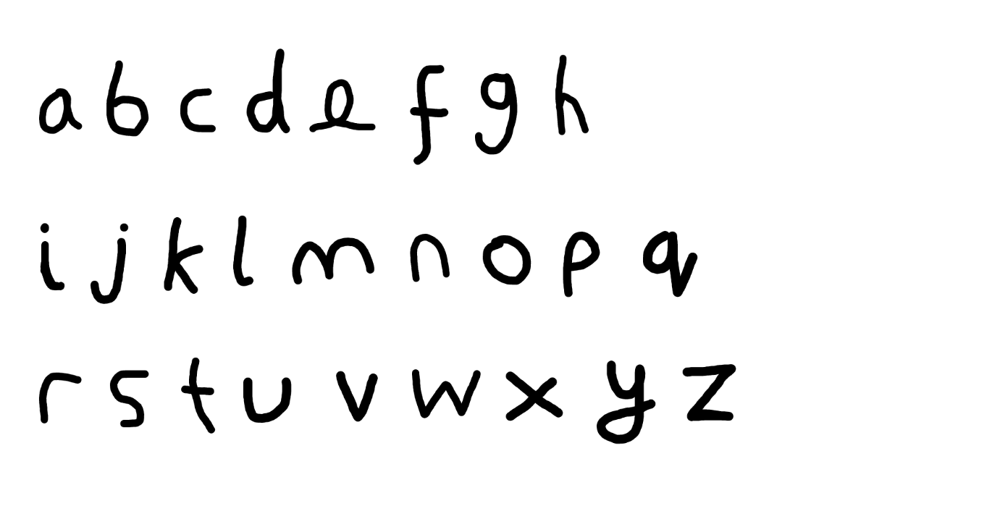

# Optical Character Recognition



This project is a naive attempt to write a computer program which is
able to recognise the words and characters that appear in an image.

## Features

1. A small set of image processing and computer vision routines written
   in C, using only `libpng`.
2. A neural network implementation written in Python, using only
   `numpy`.
3. A Python extension module written in C, wrapping 1.
4. An HTTP REST API for manipulating 2.

## Deployment

Install the Python and JavaScript dependencies and build the C library.

```sh
virtualenv env
source env/bin/activate
pip install -r requirements.txt
cd ./src/rest_api
npm install
cd ../..
cd ./src/image_pipeline/src
make
cd ../../..
```

Should the extension module fail to build (using older versions of
python), run the `setup.py` script and check the contents of the `build`
directory. Update the shared object paths in the makefile accordingly.
If the `Python.h` header file is not found, it can be located with the
command:

```sh
find /usr/include -name 'Python.h'
```

The project includes a number of unit and module tests. Test data is
provided. To test the image pipeline, having built the library:

```sh
cd ./src/image_pipeline/src
./kmeans
./test
python test_pipeline.py
ls test_output_dir # to view test output
```

A number of scripts are provided to test the neural network with
different datasets.

```sh
cd tests
python logic_gates.py
python numbers_test.py
python alphabet_test.py
```
